# World Value Survey Linear Model Comparisons
This is an assignment that was given to me in my data mining class where we were tasked to investigate data regarding responses from US citizens for the World Value Survey. The survey includes over 250 questions ranging from religion to financial well-being.

I utilized RStudio to create predictive models on how satisfied individuals are in their life based on responses to other questions in the survey. Not only will this be helpful in predicting others happiness based on different information, but we can discover what information correlates with happiness.

For the purpose of this read me I will be highlighting some general information regarding the variables used. Then I will explain the different linear models made and show the accuracies of the models.

## Dependent and Indepent Variables 
Question V23 is asking individuals how satisfied they are with their life and will be acting as my dependent variable. The following questions were used as my independent variables:
- V55 references the freedom of choice and control you have on how your life turns out.
- V56 references whether you would believe that people would take advantage of you given the chance or would they be fair.
- V59 references your satisfaction with the financial situation of your household.
- V102 references how much you trust your family.
- V152 references religion and how important God is in your life.
- V238 references what economic class you consider yourself apart of.
- V240 references what sex the respondent is.

## Investigating Variables
The distribution of responses for V55(freedom of choice) where 10 is "a great deal of choice" and 1 is "no choice at all":
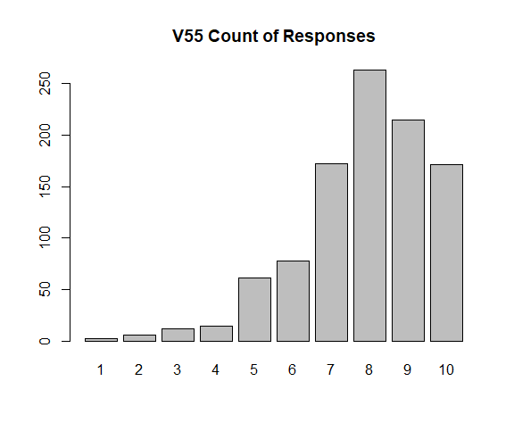

The distribution of responses for V56(if people are fair) where 10 is "people would try to be fair" and 1 is "people would try to take advantage of you":

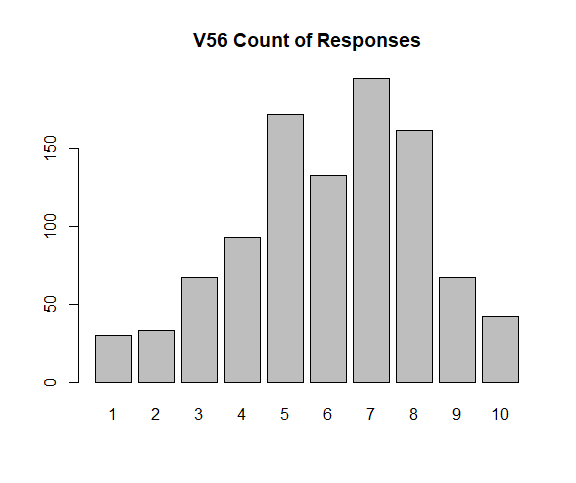

The distribution of responses for V59(financial satisfaction) where 10 is "completely satisfied" and 1 is "completely dissatisfied":
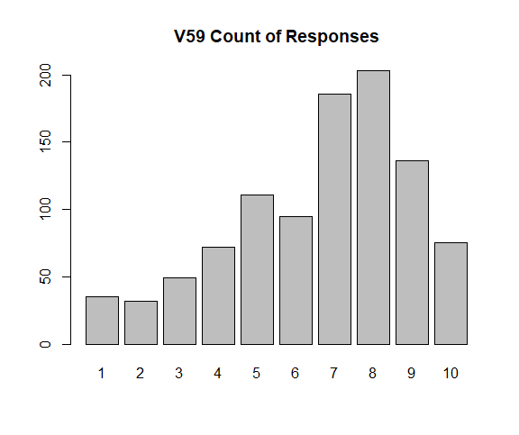

The distribution of responses for V102(family trust) where 1 is "trust completely" and 4 is "do not trust at all":
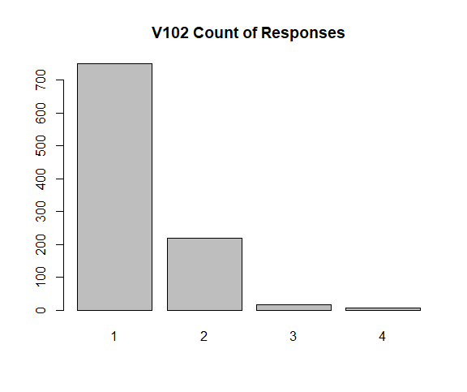

The distribution of responses for V152(importance of religion) where 10 is "very important" and 1 is "not at all important":
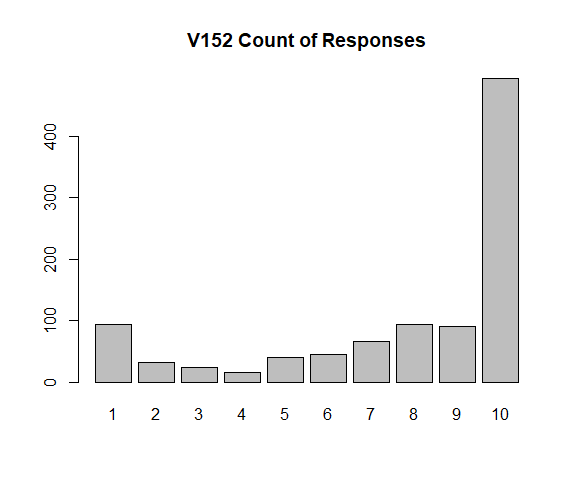

The distribution of responses for V238(economic class) where 1 is "upper class", 2 is "upper middle class", 3 is "lower middle class", 4 is "working class", and 5 is "lower class". This assignment asked to regroup the classes as depicted in the image:

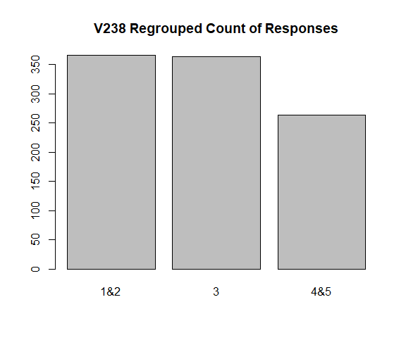

The distribution of responses for V240(gender) where 0 is "female" and 1 is "male":
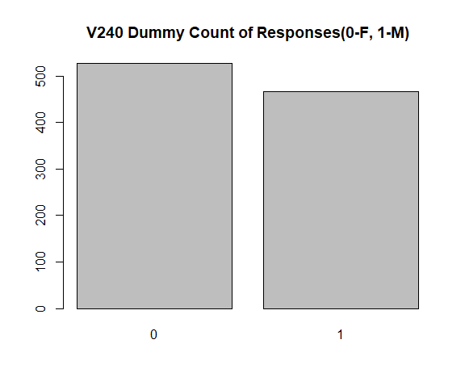

## Models
#### First Model
The first linear model I created took all independent variables into consideration. Below is the summary description for the first model. We can see which variables were significant and also that the R-Squared value was 0.4854.

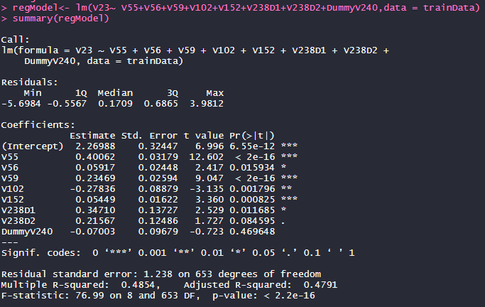

#### Gender Segmentation Model
The second model I made was segmented by gender, meaning that I grouped the data into a group where all responses were from males and another group into responses from females. Then I created training and testing data for each of those groups and a linear model to predict male life satisfaction and a linear model for female life satisfaction. I then used rbind() to combine the predicted responses and actual responses for each of these models to evaluate the accuracy later. Here is the summary for the female model where the R-Squared was 0.4867:

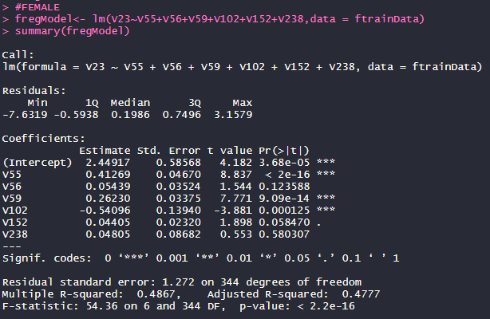

Here is the summary for the male model where the R-Squared was 0.4619:

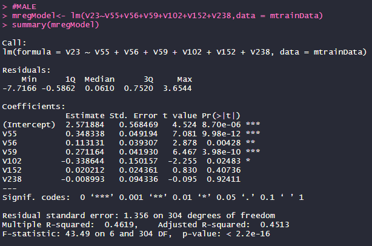

#### Economic Class Segmentation Model
The third model I made grouped the data by the economic classes that the respondents identified with. The 3 groups I made represented respondents who answered 1 or 2 for question V238, 3 as a separate group, and then 4 or 5 as the last group. Then I made training and testing for each group and a model for each. Finally, I combined predicted and actual values similar to the gender model for evaluation later. Here is the summary for the 1 and 2 group with an R-Squared of 0.4199:

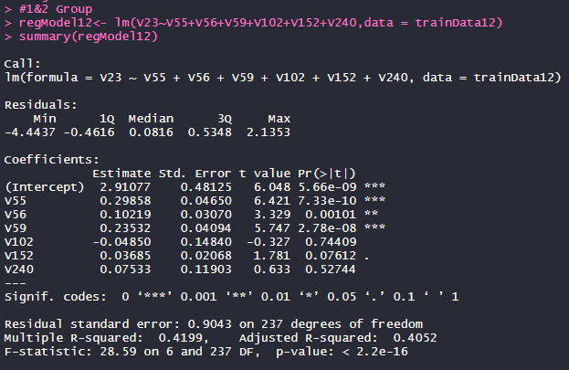

Here is the summary for group 3 with an R-Squared of 0.4654:

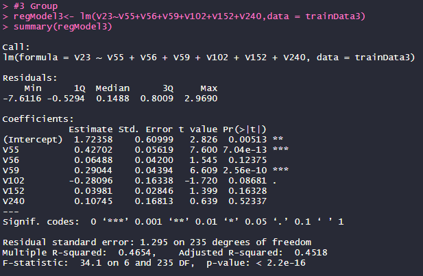

Here is the summary for group 4 and 5 with an R-Squared of 0.4151:

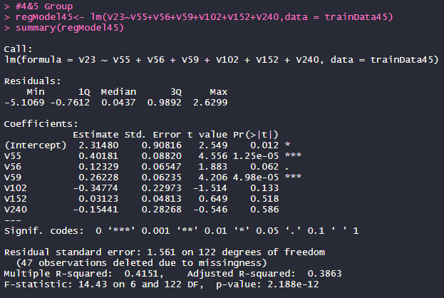

## Conclusion and Evaluation of Models

When evaluating each of these models I utilized the measures of Min-Max Accuracy and MAPE(Mean Absolute Percentage Error). Min-Max Accuracy will essentially be measuring how far the predicted values are off from the actual response values. If my predicted values exactly matched the actual values then the min-max accuracy measure would be 1, and a measure of 0 would be the worst score. MAPE looks at the difference of the predicted value and actual value as a percentage of the actual values. For MAPE, a score of 0 would be a perfect prediction and 1 would be the worst score. Below is how the equations may look:

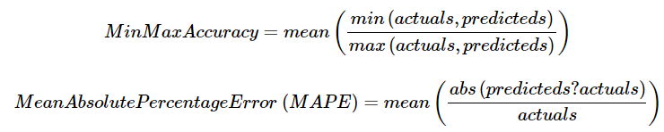

Now in this table we can see how each model compared to each other based on these two measures.

Model | Min-Max Accuracy | MAPE
----- | ---------------- | ----
Model 1 | 0.8713316 | 0.2446299
**Gender Model** | **0.8764041** | **0.1794001** 
Economic Class Model | 0.8706282 | 0.2162147

We can now see which linear regression model performed the best and how segmenting your data into different groups can make a difference in modeling. The gender model outperformed the other models in the min-max accuracy and significantly better in the MAPE score. Therefore, when choosing a model to try and predict individual's life satisfaction we would want to use the Gender Model. 
